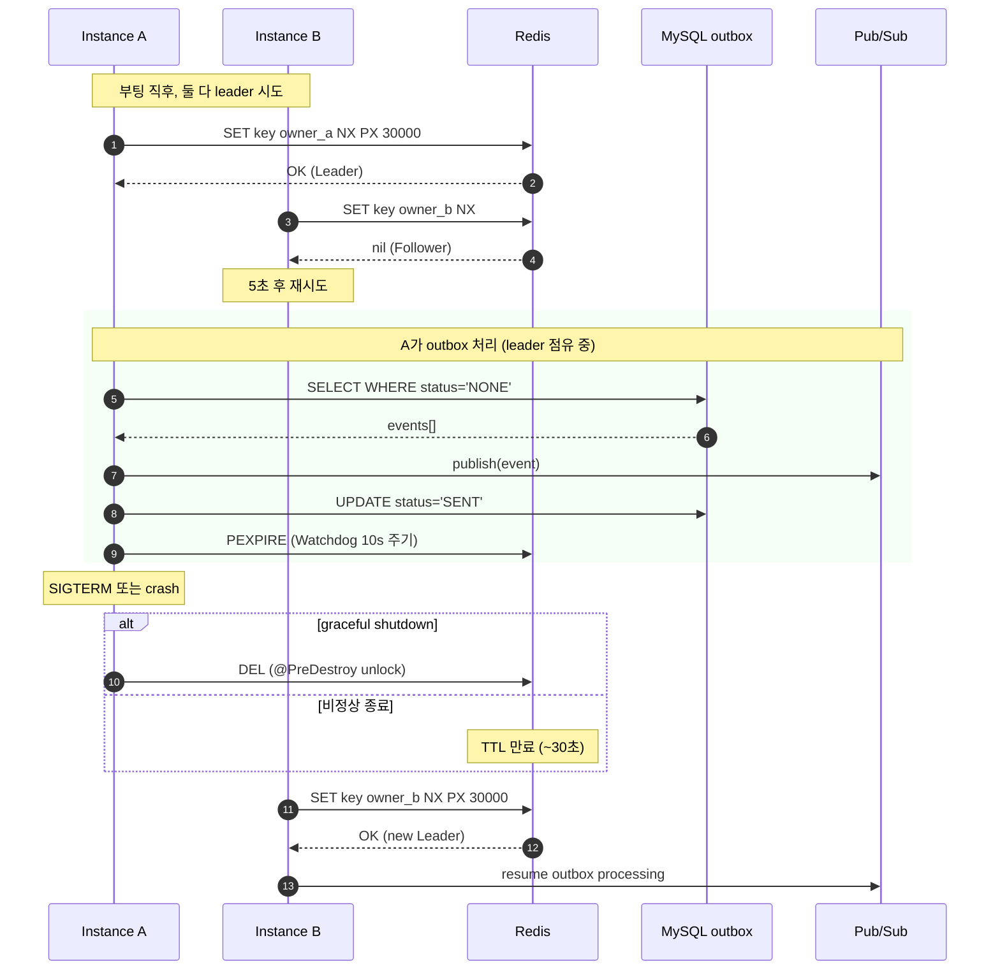

# Outbox 외부 락 (Leader Election) — Redis 기반 분석/설계

> [outbox-concurrency](./outbox-concurrency.md) 문서의 **3.6 외부 락** 옵션을 단독으로 분석한다.
> Cloud Run 멀티 인스턴스 환경에서 **"한 시점에 단 하나의 인스턴스만 Outbox를 처리"** 하도록 Redis로 leader를 선출한다.

## 1. 왜 Redis인가

| 기준 | MySQL Advisory Lock | MySQL 락 테이블 | **Redis** |
|------|---------------------|-----------------|-----------|
| 구현 복잡도 | 커넥션 점유, fencing 추가 구현 필요 | 스키마 + 4종 쿼리 직접 구현 | **SET NX PX 한 줄** |
| TTL 관리 | 세션 종료에 의존 (불안정) | NOW() 비교 직접 운영 | **네이티브 PX** |
| Heartbeat | ping 쿼리로 우회 | UPDATE 쿼리 주기 실행 | **PEXPIRE 한 줄** |
| 라이브러리 생태계 | 거의 없음 | 직접 구현 | **Redisson, ShedLock, Spring Integration** |
| 운영 가시성 | `SHOW PROCESSLIST` | SELECT로 확인 | `redis-cli GET` |
| 표준성 | 비표준 | 비표준 | **분산 락의 사실상 표준** |

Redis는 **분산 락의 표준 구현체**가 이미 존재하고, TTL을 인프라가 직접 관리해주기 때문에 직접 구현 분량이 압도적으로 적다.
MySQL 기반은 인프라가 추가로 필요 없다는 장점이 있지만, **이미 GCP를 사용 중**이라면 **Memorystore for Redis**를 붙이는 것이 정답에 가깝다.

## 2. 구현 옵션 — 라이브러리 선택

직접 구현하지 말 것. 검증된 라이브러리 3개를 비교한다.

### 2.1 ShedLock — 가장 단순

- **목적**: 스케줄된 작업이 클러스터에서 단 한 번만 실행되도록 보장
- **사용법**:
  ```java
  @Scheduled(fixedDelay = 1000)
  @SchedulerLock(name = "outbox-worker", lockAtMostFor = "30s", lockAtLeastFor = "5s")
  public void runOutbox() { ... }
  ```
- **장점**: 가장 적은 코드. `@SchedulerLock` 한 줄로 끝.
- **단점**: Leader가 **"계속 점유"** 하는 모델이 아니라, **"매 실행마다 락 획득"** 모델 → 짧은 폴링에는 부적합. 인스턴스 간 leader 핑퐁 발생 가능.
- **적합 케이스**: 1분 이상 간격 배치 작업

### 2.2 Redisson — Leader 모델에 적합 [권장]

- **목적**: Redis 기반 범용 분산 락
- **사용법**:
  ```java
  RLock lock = redissonClient.getLock("mydata-outbox-leader");
  if (lock.tryLock(0, 30, TimeUnit.SECONDS)) {
      try { runOutboxLoop(); }
      finally { lock.unlock(); }
  }
  ```
- **장점**:
  - **Watchdog 자동 갱신**: 락을 잡고 있는 동안 백그라운드에서 TTL을 자동 연장 (heartbeat 코드 불필요)
  - Pub/Sub로 락 해제 즉시 통지 → 빠른 failover (~수백 ms)
  - Fair lock, ReadWrite lock 등 확장 가능
- **단점**: 의존성 크기 (수 MB). Spring Boot starter 있음.
- **적합 케이스**: **본 프로젝트와 정확히 일치**

### 2.3 Spring Integration Redis — 가벼운 대안

- `RedisLockRegistry`로 `Lock` 인터페이스 구현체 제공
- Redisson보다 의존성 작음
- Watchdog 없음 → heartbeat 직접 구현 필요
- 본 프로젝트에는 굳이 선택할 이유 없음 (Redisson이 더 적합)

**선정**: **Redisson** (Watchdog 덕분에 운영 부담이 가장 낮다)

### 2.4 ShedLock(Redis) vs Redisson — 동작 모델 차이

ShedLock도 Redis를 지원한다 (`shedlock-provider-redis-spring`). 즉 **"락 저장소가 Redis냐 RDB냐"는 비교 포인트가 아니다**. 둘 다 Redis 위에 올릴 수 있다. 진짜 차이는 **락을 어떻게 쓰느냐**의 모델이다.

| 항목 | ShedLock + Redis | Redisson |
|------|------------------|----------|
| 락 저장소 | Redis | Redis |
| 모델 | **메서드 실행 단위** 락 — `@SchedulerLock` 진입 시 잡고 메서드 종료 시 해제 | **연속 점유** 락 — `tryLock` ~ `unlock` 사이 계속 보유 |
| TTL 갱신 | `lockAtMostFor` 동안만 유지, 자동 갱신 없음 | Watchdog 백그라운드 스레드가 자동 갱신 |
| 폴링 1초 워커에 적용 시 | 1초마다 lock/unlock 반복 → 인스턴스 간 leader 핑퐁 가능 | 한 번 leader 되면 앱 살아있는 동안 계속 점유 |
| 코드 모양 | `@Scheduled` + `@SchedulerLock` 어노테이션 | `lock.tryLock()` / `lock.unlock()` 명시 호출 |
| 적합한 케이스 | 1분 이상 간격 배치 (야간 정산 등) | 우리처럼 무한 폴링 워커 |

**우리 케이스 결론**: `OutboxWorker.run()`은 `do-while` 무한 루프 안에서 1초 단위로 폴링하는 구조다. ShedLock 모델은 메서드 1회 실행에 맞춰져 있어 코드 모양도 안 맞고, 매 사이클마다 lock/unlock 라운드트립이 발생한다. **Redisson의 "Leader가 처음부터 끝까지 들고 있는" 모델이 정확히 맞는다.**

## 3. 핵심 동작 원리

### 3.1 Redis 명령 한 줄

Redisson이 내부적으로 실행하는 것은 사실상 다음 한 줄이다:

```
SET mydata-outbox-leader <ownerId> NX PX 30000
```

- `NX`: 키가 없을 때만 set → **선착순으로 정확히 한 명만 성공**
- `PX 30000`: 30초 TTL
- 반환값이 `OK`면 leader, `nil`이면 follower

### 3.2 Watchdog (자동 Heartbeat)

**Watchdog**은 Redisson이 락을 잡을 때 자동으로 띄우는 **백그라운드 감시 스레드**다. 이름 그대로 "감시견" 역할 — 락이 만료되어 죽지 않도록 지킨다.

동작 흐름:
1. `lock.tryLock(0, -1, TimeUnit.SECONDS)` 성공 → Redis에 `SET key owner PX 30000` (30초 TTL)
2. 동시에 Redisson이 백그라운드 스레드 1개 시작
3. 그 스레드가 **10초마다 (TTL의 1/3 주기)** 깨어나서 `PEXPIRE key 30000` 실행 → TTL을 다시 30초로 리셋
4. `lock.unlock()` 호출 또는 JVM 종료 → Watchdog 스레드도 함께 종료 → 더 이상 PEXPIRE 안 함 → 30초 뒤 자연 소멸

**핵심 효과**:
- 워커가 살아있는 한 락은 영원히 유지된다 (개발자가 heartbeat 코드 작성 불필요)
- 워커가 죽거나 네트워크 단절되면 30초 안에 자동으로 풀려서 다른 인스턴스가 인계받는다

### 3.2.1 "Leader 점유 모델"이란

Redisson의 사용 방식은 **연속 점유** 모델이다. ShedLock 같은 **메서드 단위 락** 모델과 대비된다.

**Leader 점유 모델 (Redisson — 우리가 채택)**
```
[부팅] → tryLock 성공 → Leader 자격 획득
                ↓
        outbox 무한 루프 (1초 폴링 × N번)
        그동안 Watchdog가 락을 계속 살림
                ↓
[종료 시점] → unlock
```
한 번 leader가 되면 **앱이 살아있는 내내** 락을 들고 있다. 다른 인스턴스는 follower로 대기하다가, 이 leader가 죽으면 그제서야 인계받는다.

**메서드 실행 단위 락 모델 (ShedLock — 우리에겐 안 맞음)**
```
@Scheduled(fixedDelay=1000) 호출 → 락 잡기 시도
   성공 → 메서드 1회 실행 (수 ms) → 락 해제
   실패 → 그냥 종료, 다음 1초 뒤 또 시도
```
매 실행마다 락을 잡았다 풀었다 반복. 인스턴스 간 핑퐁이 발생할 수 있고, 매번 Redis 라운드트립이 든다.

### 3.3 안전한 해제 (CAS)

다른 인스턴스가 잡고 있는 락을 실수로 풀어버리면 안 된다. Redisson은 Lua 스크립트로 atomic check-and-delete를 수행:

```lua
if redis.call("get", KEYS[1]) == ARGV[1] then
    return redis.call("del", KEYS[1])
else
    return 0
end
```

owner ID가 일치할 때만 삭제 → split-brain 방지.

### 3.4 Fencing Token (선택)

Redis 단독 락은 GC pause, 네트워크 파티션 시 순간적으로 두 leader가 동시에 존재할 가능성이 이론적으로 있다 ([Martin Kleppmann의 글](https://martin.kleppmann.com/2016/02/08/how-to-do-distributed-locking.html)).

실용적 보완:
- Outbox 처리 직전에 `INCR outbox-leader-epoch` 로 단조 증가 토큰 발급
- `outbox_events`에 `processed_by_epoch` 컬럼 추가
- UPDATE 시 `WHERE processed_by_epoch IS NULL OR processed_by_epoch <= :myEpoch` 조건으로 stale leader 차단

대부분 환경에서 **3.4는 생략 가능**. Redisson의 Watchdog + CAS 해제만으로 충분하다. (Outbox는 At-least-once 전제, 다운스트림 멱등 처리가 안전망)

## 4. Spring Boot 적용 설계

### 4.1 의존성

```gradle
implementation 'org.redisson:redisson-spring-boot-starter:3.27.2'
```

### 4.2 설정 (application.yml)

```yaml
spring:
  data:
    redis:
      host: ${REDIS_HOST}        # 예: 10.x.x.x (Memorystore 내부 IP)
      port: 6379
      timeout: 3000ms

redisson:
  config: |
    singleServerConfig:
      address: "redis://${REDIS_HOST}:6379"
      connectionPoolSize: 8
      connectionMinimumIdleSize: 2
      idleConnectionTimeout: 10000
      retryAttempts: 3
      retryInterval: 1500

outbox:
  leader:
    lock-key: mydata-outbox-leader
    lease-seconds: 30
```

### 4.3 컴포넌트 구조

```
OutboxLeaderElector  ←  RedissonClient
       │
       └─ isLeader() / acquire() / release()
       │
OutboxWorker.run()  ─  if (!elector.isLeader()) { wait; continue; }
```

### 4.4 의사 코드

```java
@Component
@Slf4j
public class OutboxLeaderElector {
    private final RedissonClient redisson;
    private final String lockKey;
    private final long leaseSeconds;
    private RLock lock;
    private volatile boolean isLeader = false;
    private final String ownerId = System.getenv("HOSTNAME") + "-" + UUID.randomUUID();

    @PostConstruct
    public void init() {
        this.lock = redisson.getLock(lockKey);
    }

    /** OutboxWorker가 매 폴링 사이클마다 호출 */
    public boolean tryBecomeLeader() {
        if (isLeader && lock.isHeldByCurrentThread()) {
            return true;  // Watchdog이 TTL을 알아서 연장 중
        }
        try {
            // waitTime=0 → 즉시 시도, leaseTime=-1 → Watchdog 자동 갱신 모드
            boolean got = lock.tryLock(0, -1, TimeUnit.SECONDS);
            if (got) {
                isLeader = true;
                log.info("[{}] acquired outbox leadership", ownerId);
            }
            return got;
        } catch (InterruptedException e) {
            Thread.currentThread().interrupt();
            return false;
        }
    }

    @PreDestroy
    public void release() {
        if (isLeader && lock.isHeldByCurrentThread()) {
            lock.unlock();
            log.info("[{}] released outbox leadership", ownerId);
        }
    }
}
```

`OutboxWorker.run()` 변경 지점:

```java
public void run() {
    while (!Thread.currentThread().isInterrupted()) {
        if (!leaderElector.tryBecomeLeader()) {
            performWait(() -> 5000L);  // 5초 후 재시도
            continue;
        }
        // 기존 outbox 처리 로직
        Optional<List<OutboxEvent>> events = getNextBatch(...);
        ...
    }
}
```

## 5. Cloud Run 환경 특이사항

### 5.1 CPU Always Allocated 필수

- Cloud Run 기본 동작: 요청 처리 중이 아닐 때 **CPU throttle**
- Watchdog 스레드가 늦게 깨어나면 TTL 만료 → leader 자격 상실
- 설정: `gcloud run services update --no-cpu-throttling` 또는 콘솔 토글
- 비용은 증가하지만 outbox worker가 있는 서비스는 사실상 필수

### 5.2 Min Instances ≥ 1

- 트래픽 0일 때 인스턴스 0개 → outbox worker 정지
- Outbox 처리를 지속하려면 최소 1개 유지

### 5.3 Graceful Shutdown

- SIGTERM 후 grace period **최대 10초**
- 그 안에 `@PreDestroy`에서 `lock.unlock()` 수행 → 다음 leader 즉시 인계 (Redisson Pub/Sub로 통지)
- Spring 설정:
  ```yaml
  server:
    shutdown: graceful
  spring:
    lifecycle:
      timeout-per-shutdown-phase: 8s
  ```

### 5.4 Redis (Memorystore) 가용성

- Memorystore Standard tier 사용 시 HA 페일오버 ~30초
- 페일오버 중 락 일시 분실 가능 → 다운스트림 멱등 처리(3.4)가 안전망

## 6. 운영 가시성

### 6.1 현재 leader 확인

```bash
redis-cli GET mydata-outbox-leader
# → "instance-abc-uuid-1234"
redis-cli PTTL mydata-outbox-leader
# → 22500  (남은 TTL: 22.5초)
```

### 6.2 강제 leader 교체 (운영 사고 시)

```bash
redis-cli DEL mydata-outbox-leader
# 다른 인스턴스가 다음 폴링에서 즉시 leader 획득
```

### 6.3 메트릭

- `outbox.leader.acquired{instance=<id>}` (1=leader)
- `outbox.leader.heartbeat.failures` (counter)
- `outbox.leader.elections.total` (counter — 잦으면 불안정 신호)

## 7. Failover 시나리오

| 상황 | 동작 |
|------|------|
| Leader 정상 종료 (SIGTERM) | `@PreDestroy`에서 unlock → 다른 인스턴스가 ~수백 ms 안에 인계 |
| Leader 비정상 종료 (OOM, kill -9) | TTL 만료 후 (~30초) 다른 인스턴스가 인계 |
| Redis 네트워크 단절 | Watchdog 실패 → leader 자격 자체 상실 (자체 격리) |
| Memorystore 페일오버 | ~30초 동안 락 분실, 모든 인스턴스 follower → 페일오버 종료 후 재선출 |
| Cloud Run autoscale 새 인스턴스 | follower로 시작, 기존 leader 종료까지 대기 |

## 8. 다른 옵션과의 관계

| 옵션 | 외부 락(3.6 Redis)과의 관계 |
|------|---------------------|
| 3.1 비관적 락 (`SKIP LOCKED`) | **대체관계** — Redis로 단일 worker 보장하면 DB row-lock 불필요 |
| 3.2 낙관적 락 (`worker_id`, `version`) | **대체관계** — 동상 |
| 3.3 좀비 Reaper | **병행 필수** — leader가 SIGTERM 도중 죽으면 `READY` row 잔류 |
| 3.4 Idempotency Key | **병행 권장** — Memorystore 페일오버, leader 교체기 중복 가능성 안전망 |
| 3.5 max-instances=1 | **유사하지만 다름** — 5는 API까지 단일화, 3.6은 worker만 단일 |

## 9. 비용 추정 (대략)

- **Memorystore for Redis Basic tier (1GB)**: 월 ~$35
- **Cloud Run CPU always-on 추가 비용**: 트래픽 패턴에 따라 +30~100%
- 합산: **월 $50~150** 수준

## 10. 결론

- **Redis + Redisson** 조합이 본 프로젝트에 가장 적합한 외부 락 방식
- 코드는 `@SchedulerLock` 또는 `lock.tryLock()` 한 줄 수준 — MySQL 직접 구현 대비 압도적으로 단순
- 운영 가시성 좋음 (`redis-cli` 한 줄로 leader 확인)
- 페일오버 빠름 (Pub/Sub 통지 ~수백 ms)
- 단점: Memorystore 신규 인프라 + Cloud Run CPU always-on 비용

**의사결정 분기:**
- 비용 허용 가능 → **Redis 외부 락 (이 문서 권장)**
- 비용 부담 → 3.1 (DB SKIP LOCKED) 로 회귀

---

## 플로우차트

시퀀스: Instance A(Leader 획득) → Instance B(Follower 대기) → Outbox 처리 / Pub/Sub publish → Watchdog 갱신 → A 종료(SIGTERM) → B로 leader 인계.

### Mermaid (정확한 시퀀스용)



### Excalidraw (손그림 다이어그램)

[플로우차트 열기 (Excalidraw)](https://excalidraw.com/#json=Uguc8OJ78hVFJMIUllwRh,2hpGJrqnnCD8CRimo0jAbA)

시각적으로 라이프라인과 메시지 흐름을 확인하고 싶을 때 사용. Mermaid 쪽이 노션 내에서 바로 렌더링되므로 1차 참고는 Mermaid, 손그림 느낌으로 다시 보고 싶을 때 Excalidraw.
